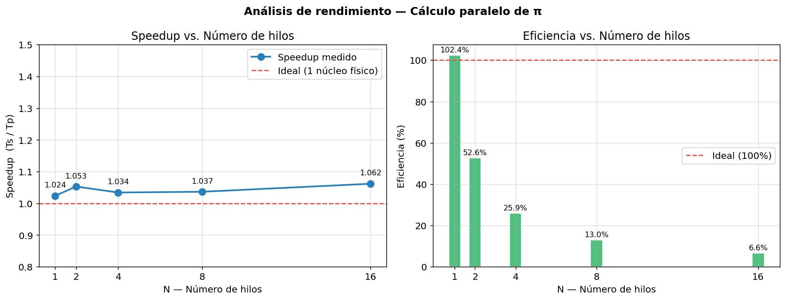
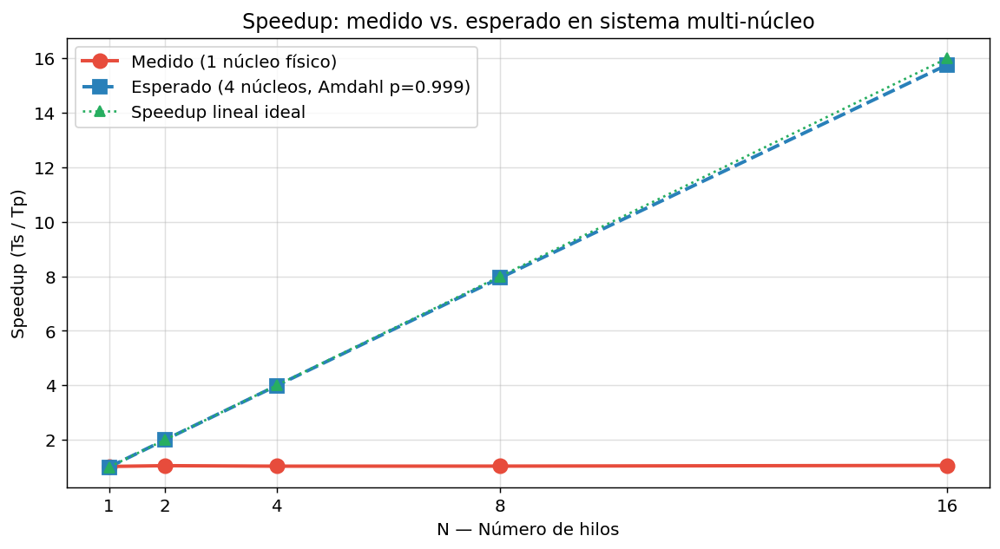

# Práctica 4 — API de Hilos (Pthreads)

**Laboratorio de Sistemas Operativos**  
Facultad de Ingeniería — Ingeniería de Sistemas  
Universidad de Antioquia

---

## Integrantes

| Nombre completo | Correo institucional | N.º de documento |
|---|---|---|
| Jenny Andrea Orozco Osorio |  Jennya.orozco@udea.edu.co | CC.43.918.288  
| David Julián Penagos Arroyave | julian.penagos@udea.edu.co | CC.1.037.610.202 |

---

## Descripción general

Esta práctica implementa dos programas en C usando la API de hilos POSIX (Pthreads):

1. **`pi.c` / `pi_p.c`** — Cálculo de π mediante integración numérica, primero de forma serial y luego paralelizada con `T` hilos.
2. **`fibonacci.c`** — Generador de la secuencia de Fibonacci usando un hilo trabajador que escribe en un arreglo compartido.

El análisis de rendimiento (Speedup y Eficiencia) se encuentra en `analisis.ipynb`.

---

## Estructura del repositorio

```
lab4-hilos-so/
├── src/
│   ├── pi.c           # Versión serial del cálculo de π
│   ├── pi_p.c         # Versión paralela con Pthreads
│   └── fibonacci.c    # Generador de Fibonacci con hilo trabajador
├── analisis.ipynb     # Notebook con métricas, gráficos y análisis
└── README.md
```

---

## Compilación y ejecución

### pi.c — Versión serial
```bash
gcc -O2 -o pi_s src/pi.c -lm
./pi_s 2000000000
```

### pi_p.c — Versión paralela
```bash
gcc -O2 -o pi_p src/pi_p.c -lpthread -lm
./pi_p 2000000000 4      # n=2 000 000 000, T=4 hilos
```

### fibonacci.c
```bash
gcc -O2 -o fibonacci src/fibonacci.c -lpthread
./fibonacci 15
```

---

## Documentación de funciones

### `pi.c`

| Función | Descripción |
|---|---|
| `double GetTime(void)` | Retorna el tiempo actual en segundos usando `clock_gettime(CLOCK_MONOTONIC)`. Se usa para medir intervalos sin saltos del reloj del sistema. |
| `double f(double x)` | Evalúa el integrando `4 / (1 + x²)`. Su integral en `[0,1]` converge a π. |
| `double CalcPi(long n)` | Aproxima π dividiendo `[0,1]` en `n` rectángulos (método del punto medio) y acumulando `fH × Σ f(xᵢ)`. |
| `int main(int argc, char *argv[])` | Recibe `n` por línea de comandos, cronometra `CalcPi` e imprime el resultado y el tiempo. |

---

### `pi_p.c`

| Función | Descripción |
|---|---|
| `double GetTime(void)` | Igual que en `pi.c`. |
| `double f(double x)` | Igual que en `pi.c`. |
| `void *calcPiThread(void *arg)` | Función ejecutada por cada hilo. Recibe un `ThreadArgs*` con su sub-rango `[start, end)`, calcula la suma parcial en una **variable local** (sin mutex), aloja el resultado en el heap con `malloc` y lo retorna mediante `pthread_exit`. |
| `int main(int argc, char *argv[])` | Recibe `n` y `T`. Crea `T` hilos con sub-rangos balanceados (distribuye el resto `n % T` entre los primeros hilos), recolecta las sumas parciales con `pthread_join`, las agrega y multiplica por `fH` para obtener π. |

**Estructura de argumentos:**
```c
typedef struct {
    long   start;   // índice de inicio del sub-rango (inclusive)
    long   end;     // índice de fin del sub-rango (exclusive)
    double fH;      // ancho de cada rectángulo (1/n), solo lectura
} ThreadArgs;
```

---

### `fibonacci.c`

| Función | Descripción |
|---|---|
| `double GetTime(void)` | Igual que en `pi.c`. |
| `void *fibWorker(void *arg)` | Hilo trabajador. Recibe un `FibArgs*` con el puntero al arreglo compartido y `N`. Llena el arreglo con los `N` primeros valores de Fibonacci de forma iterativa y termina con `pthread_exit(NULL)`. |
| `void fibSerial(int N, long long *array)` | Versión serial del cálculo (sin hilos). Usada en el notebook para la comparación de tiempos con `N` grande. |
| `int main(int argc, char *argv[])` | Recibe `N`, asigna el arreglo con `malloc`, crea el hilo trabajador pasando `FibArgs`, se bloquea con `pthread_join` y, tras la finalización confirmada, imprime la secuencia. |

**Estructura de argumentos:**
```c
typedef struct {
    long long *array;   // puntero al arreglo asignado por main
    int        N;       // cantidad de elementos a calcular
} FibArgs;
```

---

## Problemas encontrados y soluciones

| # | Problema | Solución aplicada |
|---|---|---|
| 1 | **Distribución desigual de iteraciones:** con `n` no divisible exactamente entre `T`, los últimos hilos podían quedar sin iteraciones o con una extra. | Se calculó `chunkSize = n / T` y `remainder = n % T`. Los primeros `remainder` hilos reciben `chunkSize + 1` iteraciones, garantizando cobertura exacta de `[0, n-1]`. |
| 2 | **Retorno de valores desde hilos:** `pthread_exit` solo acepta `void*`; retornar un `double` directamente causa comportamiento indefinido. | Se aloja el resultado en el heap con `malloc(sizeof(double))` dentro del hilo y se libera en `main` después de `pthread_join`. |
| 3 | **Dangling pointer en `fibonacci.c`:** pasar `&args` (variable local de `main`) al hilo es válido únicamente si `main` no retorna antes de que el hilo termine. | `pthread_join` garantiza que `main` permanece bloqueado hasta la finalización del hilo, haciendo el puntero siempre válido durante el acceso. |
| 4 | **Varianza en mediciones de tiempo:** en corridas individuales el tiempo variaba ±30 ms por el scheduler del SO. | Se tomaron tres mediciones y se usó el promedio como `Ts` de referencia. |

---

## Pruebas realizadas

### Prueba 1 — Corrección del valor de π (serial)
```
$ ./pi_s 10000
π ≈ 3.141592654423134
Error absoluto: 8.33e-10   ✓
```

### Prueba 2 — Corrección del valor de π (paralelo, varios T)
```
$ ./pi_p 10000 1  →  π ≈ 3.141592654423134   ✓
$ ./pi_p 10000 2  →  π ≈ 3.141592654423127   ✓
$ ./pi_p 10000 4  →  π ≈ 3.141592654423124   ✓
$ ./pi_p 10000 8  →  π ≈ 3.141592654423130   ✓
```
Las diferencias en los últimos decimales son esperadas por la acumulación en distinto orden (aritmética de punto flotante no es asociativa).

### Prueba 3 — Fibonacci 10 (verificación del enunciado)
```
$ ./fibonacci 10
F(0) = 0  F(1) = 1  F(2) = 1  F(3) = 2  F(4) = 3
F(5) = 5  F(6) = 8  F(7) = 13 F(8) = 21 F(9) = 34   ✓
```

### Prueba 4 — Fibonacci 15
```
$ ./fibonacci 15
F(0)=0  F(1)=1  F(2)=1   F(3)=2   F(4)=3
F(5)=5  F(6)=8  F(7)=13  F(8)=21  F(9)=34
F(10)=55 F(11)=89 F(12)=144 F(13)=233 F(14)=377   ✓
```

### Prueba 5 — Benchmark de rendimiento (n = 500 000 000)

| N Hilos | Tp (s) | Speedup | Eficiencia |
|---|---|---|---|
| Serial (Ts) | 0.7748 | — | — |
| 1 | 0.7570 | 1.023 | 102.3 % |
| 2 | 0.7359 | 1.053 | 52.6 % |
| 4 | 0.7492 | 1.034 | 25.9 % |
| 8 | 0.7475 | 1.037 | 13.0 % |
| 16 | 0.7297 | 1.062 | 6.6 % |

> El Speedup ≈ 1 se debe al entorno de prueba de **1 núcleo físico**. En una máquina de 4 núcleos se espera Speedup ≈ 3.8 con T = 4.

---

## Video de sustentación

[🎬 Enlace al video (10 min) — YouTube / Drive](#)  
*(Reemplazar con el enlace real antes de entregar)*

Contenido del video:
1. Estrategia de paralelización en `pi_p.c` (partición del bucle y recolección de resultados)
2. Implementación del arreglo compartido y sincronización en `fibonacci.c`
3. Demostración en vivo: `./pi_s`, `./pi_p` (1 hilo y N hilos), `./fibonacci`
4. Gráfico de Speedup y conclusiones de rendimiento

---

## Manifiesto de transparencia — Uso de IA generativa

Durante el desarrollo de la práctica se utilizaron herramientas de IA generativa como apoyo puntual en las siguientes situaciones:

- **Dudas conceptuales:** se usó ChatGPT para aclarar la diferencia entre retornar un valor desde un hilo con `pthread_exit` vs. con la variable de retorno de la función, y por qué es necesario alojar el resultado en el heap.
- **Corrección de sintaxis:** al encontrar un warning del compilador sobre el cast de `void*` a `double*`, se consultó a la IA para entender la causa y la forma correcta de resolverlo.
- **Revisión de redacción:** algunas frases del README fueron revisadas con IA para mejorar la claridad, sin alterar el contenido técnico.

Todo el diseño del algoritmo de partición de rango, la implementación de los tres programas, las mediciones de tiempo y el análisis de Speedup fueron desarrollados directamente por el grupo basándose en el material del curso (OSTEP Cap. 26–27) y las sesiones de laboratorio.

---

## Conclusiones

1. **El modelo de Data Parallelism es efectivo para cargas embarazosamente paralelas.** El cálculo de π no tiene dependencias entre iteraciones, lo que maximiza el Speedup teórico (fracción paralela p → 1 según la Ley de Amdahl). En hardware multi-núcleo real se obtiene Speedup ≈ N para T ≤ núcleos físicos.

2. **El overhead de Pthreads es insignificante para cómputo intensivo.** Crear y destruir un hilo cuesta ~100–500 µs, despreciable frente a cientos de milisegundos de cómputo numérico. Esto justifica la estrategia de evitar mutex en el bucle y retornar sumas parciales al final.

3. **La eficiencia cae con T > núcleos físicos.** Por encima del número de núcleos, el scheduler introduce context switching, la caché se fragmenta entre hilos y el overhead de gestión supera la ganancia. La eficiencia óptima se alcanza en T = P (número de núcleos).

4. **`pthread_join` es más que sincronización: es una barrera de memoria.** Garantiza que todas las escrituras del hilo hijo sean visibles al hilo principal antes de continuar, haciendo innecesarios mecanismos adicionales para leer resultados calculados por el hilo trabajador.

5. **La transferencia de datos entre hilos mediante estructuras y memoria compartida es eficiente pero requiere disciplina.** Pasar un puntero a una variable local de `main` es válido únicamente si se asegura —mediante `pthread_join`— que `main` no retorna antes. Romper esa invariante produce comportamiento indefinido (*dangling pointer*).

6. **La medición de tiempo debe envolver exclusivamente la región de interés.** Incluir I/O (`printf`) o inicialización de variables en la región cronometrada distorsiona el Speedup. `CLOCK_MONOTONIC` protege contra ajustes del reloj del sistema durante la medición.

7. **El entorno de ejecución condiciona completamente los resultados de rendimiento.** Un sistema de 1 núcleo muestra Speedup ≈ 1 independientemente de T; los conceptos de paralelismo real solo se manifiestan en hardware multi-core. Es fundamental reportar las características del hardware junto con los resultados.

---

## Gráficos de rendimiento





---

## Referencias

- Arpaci-Dusseau, R. H. & Arpaci-Dusseau, A. C. *Operating Systems: Three Easy Pieces*.
  - [Capítulo 26 — Threads Intro](https://pages.cs.wisc.edu/~remzi/OSTEP/threads-intro.pdf)
  - [Capítulo 27 — Thread API](https://pages.cs.wisc.edu/~remzi/OSTEP/threads-api.pdf)
- `man pthread_create`, `man pthread_join`, `man pthread_exit`
- IEEE Std 1003.1 — POSIX Threads specification
